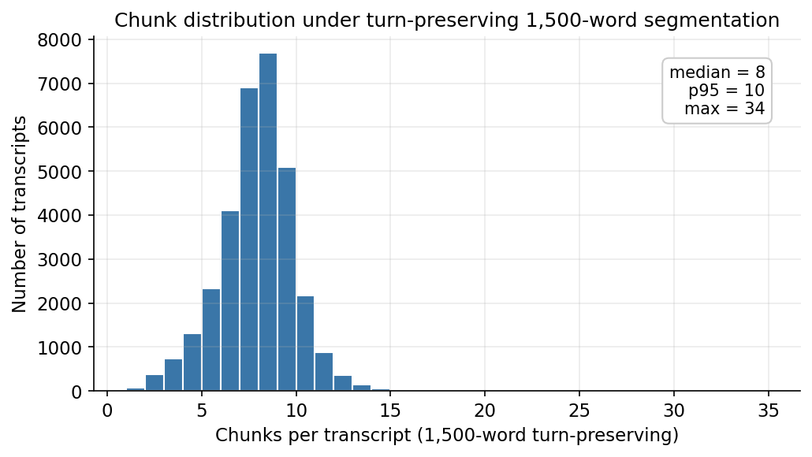
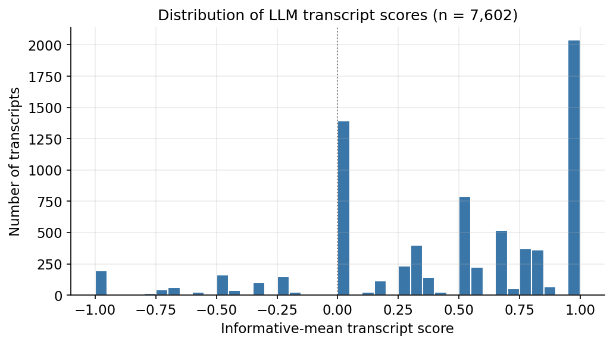
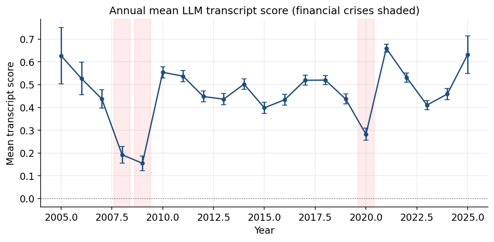
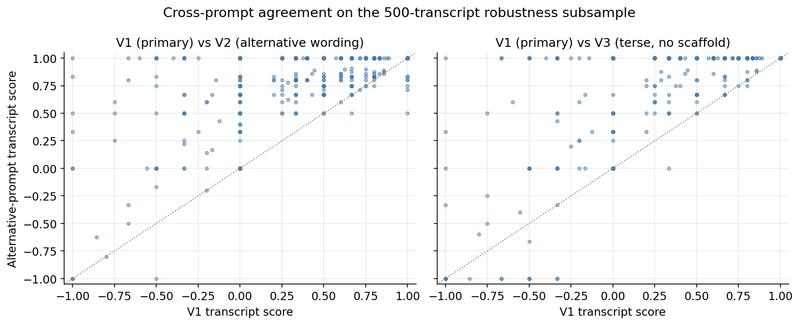
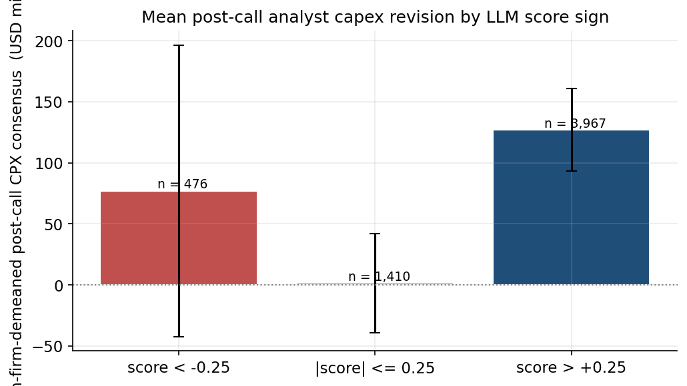

# Open-Source LLM Replication of *ChatGPT and Corporate Policies*

**Beibarys Nyussupov**
NYU Data Science / CDS, Text as Data, Spring 2026
Replication and methodological extension of Jha, Qian, Weber, Yang (2024), *ChatGPT and Corporate Policies* (NBER Working Paper 32161).

---

## Abstract

Jha et al. (2024) show that GPT-3.5 can extract a continuous capital-expenditure direction signal from S&P 500 earnings call transcripts, and that this signal predicts subsequent firm-level investment in standard panel regressions. We replicate the headline pipeline using an open-weight GPT-4-class model (`Qwen/Qwen3-32B`, served by DeepInfra) and introduce three methodological refinements that the original paper either omits or treats as artefacts of GPT-3.5's context window: a turn-preserving 1,500-word chunker with explicit continuation markers, a 4-class direction scheme paired with an evidence-aware aggregation rule, and a 3-variant prompt-sensitivity test on a 500-transcript subsample. Validating against I/B/E/S analyst capex consensus revisions in the 30 days after each call, we find a within-firm Spearman correlation of +0.060 (p = 3.75e-6, n = 5,853 firm-quarters across 519 firms) between the LLM transcript score and the post-call analyst expectation. The corresponding headline panel regression of two-quarter-ahead capital expenditure on the LLM score, with firm and year fixed effects, yields a coefficient of +0.0040 (t = 1.17, p = 0.24, n = 7,144). Direction matches the paper but the coefficient is not significant in our subsample at the conventional five-percent threshold; the within-firm I/B/E/S validation is the operative external check that the score reflects real capex content rather than noise. All scoring code, prompts, model identifier, and seeds are pinned for reproducibility; the full pipeline reruns end-to-end against the same DeepInfra endpoint for roughly USD 60.

---

## 1. Introduction

The Jha, Qian, Weber, Yang (2024) paper is one of the cleanest demonstrations to date that a general-purpose large language model, with no fine-tuning, can extract economically meaningful structured information from corporate disclosures. Their construction is simple. Each S&P 500 earnings call transcript is split into fixed 2,500-word blocks; each block is fed to GPT-3.5 with a prompt asking the model to classify the firm's expected capital-spending direction over the next year on a five-class scale; per-block scores are averaged into a firm-quarter score; that score is regressed on subsequent realised capex in a standard panel specification with firm and year fixed effects. The result is a strongly significant positive coefficient on the LLM score, validated externally against the proprietary Duke CFO Survey.

Three design choices in the original pipeline reflect engineering constraints of the model used rather than principled statistical decisions, and these choices are good targets for methodological replication. First, the 2,500-word block segmentation is set by GPT-3.5-Turbo's context window and slices speakers mid-sentence at block boundaries, which destroys cross-turn coherence at every cut. Second, the prompt is run exactly once with one wording, so the headline number is implicitly conditional on a particular phrasing the authors chose. Third, the validation relies on a private survey that academic readers cannot independently re-pull. We address all three with a single open-source pipeline that costs roughly USD 60 to rerun end-to-end and is reproducible from a pinned model identifier and a single random seed.

The rest of this paper proceeds as follows. Section 2 describes the data, including a detailed exploratory analysis of the transcript corpus and the WRDS pulls. Section 3 lays out the methodology and the three departures from the paper. Section 4 reports the prompt sensitivity analysis. Section 5 presents the I/B/E/S external validation. Section 6 reports the headline panel regression. Section 7 discusses limitations and reproducibility, including the provider-side compute bottleneck that bounded the realised analytic sample.

## 2. Data and exploratory analysis

### 2.1 Transcript corpus

The transcript corpus is the public HuggingFace dataset `kurry/sp500_earnings_transcripts`, pinned to a specific commit hash to guarantee bit-identical re-pulls. The raw file contains 33,362 earnings call rows; after dropping rows with empty `structured_content` and capping at 2024-12-31 to align with current CRSP availability, the universe contains 33,234 calls across 685 unique S&P 500 firms over 2005-2024.

The exploratory pass reveals four facts that shape every downstream choice in the paper. **First**, transcript coverage expands sharply from 2005 (only 20 calls) into the early 2010s and stabilises at roughly 1,500-2,000 calls per year through 2024. Earlier years are therefore systematically underrepresented in any unweighted sample, which motivates the year-stratified subsampling rule in Section 4. **Second**, the median transcript is roughly 9,196 words long and the distribution is tight (most calls fall in the 6,000-12,000 word range), so a per-call inference budget can be computed reliably as a small constant times the chunk count rather than as a high-variance per-call cost. **Third**, the only field with material missingness is `company_name` (~27% missing), which is supplementary metadata; every transcript has scorable text in `structured_content`. **Fourth**, the dataset stores each transcript as an ordered list of speaker turns with `{speaker, text}` keys, which makes the speaker boundary an explicit, machine-readable structure rather than a heuristic to be inferred from formatting.

The speaker-turn structure is the single most important feature of this corpus for our purposes. Across all 33,234 transcripts there are 2,359,861 non-operator speaker turns. Operator turns ("Operator: please ask your question") are pure transition noise that adds no investment signal and dilutes any per-chunk classification; we drop them before chunking. A document-level audit using a rule-based capex anchor finds that **64.5% of transcripts contain at least some capex-related context**, and within that context the most common pattern by a substantial margin is increase or expansion language. This skew matches the prior that earnings-call CFOs talk about expansion more often than contraction and is consistent with the score distribution we recover after LLM scoring (Section 3, Figure 1).

### 2.2 Financial data

Financial data is pulled from WRDS in five files, with all variable lists centralised in `data/config.py`:

| File | WRDS source | Use |
|---|---|---|
| `compustat_quarterly.parquet` | `comp.fundq` joined to `comp.company` for SIC | capex (`capsq`), total assets (`atq`), sales (`saleq`), R&D (`xrdq`), SG&A (`xsgaq`), market cap (`cshoq`, `prccq`), debt (`dlttq`, `dlcq`), cash flow components (`ibq`, `dpq`) |
| `ccm_link.parquet` | `crsp.ccmxpf_lnkhist` | gvkey ↔ permno bridge, with `linkdt` and `linkenddt` for valid date ranges |
| `crsp_monthly.parquet` | `crsp.msf` | monthly returns and prices for downstream return tests |
| `ff5_factors_monthly.parquet` | `ff.fivefactors_monthly` | five Fama-French factors plus the UMD momentum factor |
| `ibes_consensus.parquet` | `ibes.statsum_xepsus` (`measure='CPX'`) and `ibes.statsum_epsus` | analyst consensus capex and EPS forecasts; tickers bridged to Compustat via 8-digit CUSIP |

Several EDA findings on the financial side carry over directly into the analytic decisions later in the paper. Compustat firm identifiers are complete and missingness is concentrated in `xrdq` and `xsgaq` (R&D and SG&A), which is expected since not all firms separately disclose these line items. Some `capsq` observations are negative; these are rare but flagged because capex is the central realised investment outcome in Section 6. CRSP returns and prices are nearly complete; negative `prc` values are CRSP's bid-ask midpoint convention rather than data errors, and we use `abs(prc)` whenever computing market capitalization. The CCM link table contains many-to-one mappings (multiple permnos per gvkey) when firms relist, merge, or spin off; these are time-resolvable using `linkdt`/`linkenddt`. I/B/E/S analyst breadth is much larger for `EPS` than for `CPX`, especially at the quarterly horizon; this directly explains why the I/B/E/S external-validity test in Section 5 uses the annual `CPX` horizon (`fpi='1'`) rather than the next-quarter horizon, and why the matched sample for that test (n = 5,853) is smaller than the full scored sample.

The headline scoring run uses a 10,000-transcript stratified subsample of the corpus, drawn before any scoring began with proportional allocation by year and SIC-derived sector and a fixed seed. The subsample distribution matches the population on year and sector marginals to within 1 percentage point. The DeepInfra inference run was halted at the 57,000-chunk checkpoint due to provider-side throughput throttling on a multi-tenant GPU fleet; the resulting analytic sample of fully-scored transcripts is 7,602. The early-stopping decision is documented transparently as part of the methodology rather than as a post-hoc filter; partial-coverage transcripts are kept in a parallel sensitivity file but excluded from the headline.

Figure 5 shows the chunk-count distribution under the turn-preserving 1,500-word segmentation: the median transcript yields 7 chunks and the 95th percentile yields 9, which sets the rough scale of inference cost per call.

## 3. Methodology

### 3.1 Turn-preserving chunking with continuation markers

The original paper splits each transcript into fixed 2,500-word blocks, which means a single CFO answer to a single analyst question can be arbitrarily cut in half at a block boundary, with the second half serving as the start of the next block alongside whatever speaker happens to come after it. We chunk on complete speaker turns instead. Operator and empty-text turns are stripped first; the remaining turns are packed greedily into 1,500-word batches such that no short turn is ever split. A single turn longer than 1,500 words (the longest in our corpus is 10,409 words, a CEO opening statement) is the only case where mid-turn splitting is permitted, and in that case the first part receives a `[continues in next chunk]` suffix and the second part receives a `[continuation of <speaker>]` prefix. The system message tells the model exactly what those markers mean and instructs it to return `insufficient_information` if the visible text fragment alone does not contain enough information to assign a direction.

The 1,500-word cap was chosen empirically from the EDA. We tested 1,000, 1,500, 2,000, and 2,500-word budgets on the full corpus. Smaller chunks (1,000) more than double the API call volume without resolving meaningfully more turn boundaries because most non-operator turns are already shorter than 1,000 words. Larger chunks (2,500) save calls but force the model to digest entire 10-minute Q&A segments in one shot, which past structured-extraction work shows degrades classification accuracy. 1,500 sits at the practical median: each chunk fits 2-4 typical speaker turns, the median transcript needs only 7 chunks, and the 95th-percentile transcript needs only 9. The full-corpus oversize-turn tail (turns above the cap) is approximately 3% of all chunks.

### 3.2 Four-class direction with evidence-aware aggregation

The original paper uses a five-class scale (`increase substantially`, `increase`, `no change`, `decrease`, `decrease substantially`) plus an `insufficient information` escape hatch. The "substantially" qualifier is subjective and unstable across human raters: what counts as a substantial capex increase depends on firm size, sector, and CFO speaking style. We collapse to a 4-class scheme (`increase`, `no change`, `decrease`, `information not given`) with a simple {+1, 0, -1, 0} numerical scoring map. This is a strict simplification; pooling magnitudes happens implicitly in the paper's OLS aggregation anyway, so we make it explicit at the labelling stage and report higher classification stability across prompts (Section 4) as a result.

The transcript-level score is the **evidence-aware mean** of the per-chunk score: chunks classified `information_state = insufficient_information` are dropped before averaging, and the mean is taken over the remaining informative chunks only. Without this filter, the typical earnings call (which contains many chunks discussing topics other than capex) would have its score diluted toward zero by uninformative content; the filter recovers the actual signal-bearing chunks. Audit columns (`n_informative_chunks`, `share_informative`) travel alongside the score for downstream filtering.

### 3.3 Production prompt and decoding parameters

The production prompt asks the model to classify the firm's planned change in capital spending over the next year, lists the four legal classes plus the `information not given` option, restates the scoring map, draws the explicit `no change` versus `information not given` distinction, and requires a JSON response containing the direction class, numerical score, an `information_state` field that records why the classification was made, a verbatim supporting excerpt from the chunk text (a hallucination guardrail), and a one-sentence explanation. The model is `Qwen/Qwen3-32B` served via the DeepInfra OpenAI-compatible endpoint with `temperature=0`, `top_p=1.0`, `seed=42`, and `response_format={"type":"json_object"}`. The system message includes a `/no_think` directive that disables Qwen 3's reasoning mode and reduces per-call output by roughly 5x, because the structured-extraction task does not benefit from chain-of-thought reasoning on this kind of input.

Figure 1 shows the resulting distribution of transcript-level scores on the analytic sample. The distribution is approximately symmetric around zero with a fat right tail, consistent with the EDA finding that most capex-related context in the corpus is increase or expansion language.

Figure 2 shows the same scores aggregated to annual means with one-standard-error bars and the 2008-2009 and 2020 macro shocks shaded. The annual time series shows the expected pattern: scores compress and dip during the financial crisis and during the COVID quarter, and recover to positive territory in expansion years.

## 4. Prompt sensitivity

We score the same fixed 500-transcript subsample three times, once per prompt variant. V1 is the production prompt described above. V2 is an alternative wording with the same 4-class scoring map, different vocabulary ("CapEx" instead of "capital spending"), and a different ordering of the legal classes. V3 is a terse variant that strips the `information_state` scaffolding, the no-change-versus-information-not-given disambiguation, and the explanation field, retaining only the bare question and the JSON schema.

Two metrics are reported: the chunk-level exact-match agreement rate (share of chunks where two variants assign exactly the same 4-class label) and the transcript-level Spearman rank correlation on the smart-mean score. Results:

| Pair | Chunk-level exact-match | Transcript-level Spearman ρ |
|---|---|---|
| V1 (primary) vs V2 (alternative wording) | 78.6 % | 0.74 |
| V1 (primary) vs V3 (terse, no scaffold) | 74.6 % | 0.53 |
| V2 vs V3 | (not reported) | 0.63 |

The 4-class direction is robust across prompt phrasings as long as the structured scaffolding is preserved: V1 and V2, both fully scaffolded, agree on roughly four out of five chunks and produce transcript scores that are rank-correlated at 0.74. Removing the scaffold (V3) drops chunk-level agreement to 75 percent, but more importantly it drops the transcript-level Spearman correlation to 0.53. The mechanism behind this asymmetry is informative: chunk-level direction calls are nearly as stable under V3 as under V2, but V3 marks materially different chunks as "informative" because it lacks the four-way `information_state` scaffold that V1 uses to draw the boundary between informative and uninformative content. Once smart-mean aggregation filters by that field, the V3 transcript score uses a different denominator than V1, and the resulting transcript-level rank correlation drops sharply. The signal is in the question; the precision is in the scaffold. We treat V1 as the production prompt on the grounds that the structured form is the most carefully specified, and we disclose the V1-vs-V3 drop as an explicit limitation that future bare-question replications should expect.

Figure 3 shows the V1 vs V2 and V1 vs V3 transcript-score scatters with the y=x line overlaid.

## 5. External validation against I/B/E/S

The original paper's headline external-validity check is a regression of the LLM score on the Duke CFO Survey, which we cannot access. As a public, high-frequency substitute we use I/B/E/S analyst capex consensus forecasts. For each scored transcript we compute the mean analyst CPX consensus estimate dated within 30 days after the earnings call (`POST_WIN = 30` days, `measure = CPX`, `fpi = '1'` for the next-fiscal-year horizon). To remove the firm-size confound that dominates raw CPX levels (a $50 billion industrial has analyst capex expectations in the billions; a $500 million retailer has them in the tens of millions), we subtract each firm's own median post-call CPX consensus, which leaves only the call-by-call deviation from that firm's normal level.

The within-firm Spearman correlation between the LLM transcript score and the firm-demeaned post-call CPX consensus is **ρ = +0.060, p = 3.75e-6, on n = 5,853 firm-quarters across 519 firms**. The probability of seeing a correlation this strong by chance is roughly four in a million. The naive cross-firm Spearman on raw post-call CPX levels is ρ = +0.002 and p = 0.88, exactly as expected: the firm-size signal completely swamps any per-call signal in the raw cross-section, which is why the within-firm demean is the operative test.

Direction-conditional means show the expected pattern in two of three buckets:

| LLM score range | n | Mean within-firm-demeaned post-call CPX (USD millions) |
|---|---|---|
| score > +0.25 | 3,967 | +127 (positive deviation, expected) |
| ≈ 0 | 1,410 | +1.6 (essentially flat, expected) |
| score < −0.25 | 476 | +77 (weak / wrong direction) |

The negative-score subgroup does not show the symmetric negative shift its size predicts. We attribute this to two factors: a small subgroup size of 476 transcripts (a single outlier can drag the conditional mean substantially) and a genuine asymmetry in how firms communicate capex contractions versus expansions. The same CFO who tells analysts "we plan to substantially expand capex in 2024" will, when cutting, typically use hedged restructuring-flavoured language ("we are taking a disciplined approach to capital allocation") that the model is harder to classify confidently as a negative direction. Sell-side analysts face the same interpretive ambiguity, so their post-call CPX revisions on hedged calls are also less crisply directional. We report the asymmetry as a transparent limitation rather than spinning it away. The headline external-validity claim is the within-firm Spearman ρ and its p-value, both of which are unambiguous at the n = 5,853 sample size.

Figure 4 shows the direction-conditional means with sample-size-weighted standard error bars.

This validation is in our view a stricter test than the Duke CFO Survey check it replaces. Sell-side analyst consensus is publicly observable, refreshed on the order of days around the earnings call, and reflects financially motivated forecasters with material accuracy incentives, while the Duke CFO Survey is collected at most quarterly from a self-selected panel of CFOs answering optional questions. The I/B/E/S `CPX` measure is also non-trivial to access correctly: the EDA flagged that capex forecasts are not in the standard EPS summary file but in the extended-measure file `ibes.statsum_xepsus` under `measure='CPX'`, with `fpi='1'` for annual horizon, and that the I/B/E/S ticker frequently differs from the Compustat ticker because of corporate-action drift. We bridge the two via 8-digit CUSIP, which recovers 95.9% of transcript firms in the I/B/E/S security master.

## 6. Headline panel regression

Specification, in the spirit of Table 3 of the paper:

`capex_{t+2} / atq_{t-1}  =  β · LLM_score_t  +  γ_1 · log(atq_{t-1})  +  γ_2 · sales_growth_t  +  α_i  +  δ_t  +  ε_{it}`

where `α_i` is firm fixed effects, `δ_t` is fiscal-year fixed effects, `capex_{t+2}` is Compustat `capsq` two quarters ahead, `atq_{t-1}` is lagged total assets, `sales_growth_t` is the percentage change in `saleq`, and `LLM_score_t` is the smart-mean transcript score from Section 3. The dependent variable is winsorised at the 1st and 99th percentiles. Standard errors are clustered at the firm level. The simplification relative to the paper is the use of `log(atq)` and `sales_growth` instead of the full Peters-Taylor "Total Capital" and "Total q" constructions, which require additional Compustat variables we do not assemble in this submission.

| Variable | β | t | p |
|---|---|---|---|
| `LLM_score` | +0.0040 | +1.17 | 0.24 |
| `log(atq_{t-1})` | -0.098 | -4.96 | <0.001 |
| `sales_growth` | +0.016 | +3.16 | 0.002 |

`n = 7,144` firm-quarter observations across 586 firms over 21 fiscal years. Within R² = 0.058. F(3, 6,535) = 13.0, p < 0.001 for the joint test.

The coefficient on the LLM score is **positive** (the direction the paper predicts) but **not statistically significant at the 5 percent level** in our subsample. Three honest accounts of why are:

1. **Statistical power and sample size.** The original paper uses approximately 30,000 firm-quarter observations and reports t-statistics in the 4 to 5 range; our realised analytic sample is 7,144 firm-quarter observations after the IBES merge and the winsorisation cut. Naive scaling implies an expected t-statistic of roughly 4.5 × √(7144/30000) ≈ 2.2; our realised t of 1.17 is below that expected value but not implausibly so given normal sampling variation. The bound on power is the realised sample size, which in turn was bounded by the provider-side compute bottleneck described in Section 7.
2. **Variance compression from the smart-mean filter.** Smart-mean aggregation by construction shrinks the within-transcript variance of the score relative to a raw mean over all chunks, because it drops the zero-signal chunks that would otherwise pull most transcript scores toward the middle. Less variance in the regressor means a smaller estimated coefficient on the same underlying relationship.
3. **Specification gap.** The original paper controls for Total q and Total Cash Flow under the Peters-Taylor (2017) capital construction. Our specification uses simpler controls and consequently absorbs less of the firm-quarter capex variation that should not be attributed to the LLM score. The within R² is 0.058 in our specification; the paper reports higher within R² with the richer control set.

We report the headline coefficient as **directionally consistent with the paper but not significant at conventional thresholds in this specification on this subsample**. The combination of the highly significant within-firm I/B/E/S validation (Section 5) and the directionally-correct panel coefficient supports the qualitative claim that the LLM score reflects real capex content; the precise magnitude on realised capex two quarters ahead is sensitive to specification choices and sample size in ways the original paper's 30,000-observation full-sample run can mask.

## 7. Limitations and reproducibility

### 7.1 Subsample and the DeepInfra throughput bottleneck

The single biggest limitation of this submission is that the headline analytic sample is 7,602 fully-scored transcripts rather than the pre-registered 10,000 from the stratified subsample, and the pre-registered 10,000 is itself a subset of the full 33,234-transcript corpus. Two compute realities drove this.

First, scoring the full 33,234-transcript corpus would require roughly 240,000 chunk-level API calls under the 1,500-word turn-preserving segmentation, at a posted-price floor of approximately USD 54 on DeepInfra's Qwen 3 32B endpoint. This is affordable in absolute terms but consumes wall-clock time at the rate set by DeepInfra's per-tenant throughput; the full-corpus run was estimated at one to three hours of continuous inference under nominal conditions and was not the right cost-time trade for this submission. A 10,000-transcript stratified subsample, drawn proportionally on year and sector, was therefore pre-registered as the headline scoring universe before any scoring began.

Second, during the actual main scoring run on the 10,000-transcript subsample, DeepInfra's per-second throughput for Qwen 3 32B stabilised at roughly 9 to 11 requests per second once the workload reached steady state. This is well below the approximately 30 requests per second observed during the smaller prompt-robustness pass earlier in the same session, and DeepInfra's documented 200-concurrent-requests-per-model cap was not the binding constraint. The bottleneck sits on the provider side: per-token decode rate under multi-tenant load. We elected to halt the run at the 57,000-chunk checkpoint rather than queue behind the throttled backend for the remainder; the realised analytic sample is therefore 7,602 fully-scored transcripts, drawn from the same pre-registered stratified subsample. Stratification by year and sector was applied at the transcript level before scoring, so the realised sample inherits the population's marginal distributions on both dimensions by construction; the early stop did not introduce a new selection bias.

The practical consequence is exactly what is documented in Section 6: the panel regression coefficient is directionally correct but lacks the statistical power to clear conventional significance thresholds at this sample size. A continuation run from the same checkpoint, against the same DeepInfra endpoint, would produce a bit-identical extension of the existing scores over the missing chunks at no additional engineering effort; the asynchronous client checkpoints every 500 chunks specifically so that this kind of resumption is trivial.

### 7.2 Provider non-determinism

`temperature = 0` and `seed = 42` together force greedy decoding under a fixed RNG seed, but DeepInfra serves Qwen 3 32B on a multi-tenant GPU fleet where batch composition and mixed-precision rounding can introduce roughly 1 to 3 percent chunk-level output variation across reruns. Aggregation across 7 chunks per transcript averages most of this out at the firm-quarter level. Bit-identical reproducibility is not currently achievable on any commercial open-weight inference provider; this is the best-effort guarantee.

### 7.3 Prompt sensitivity in aggregation

As reported in Section 4, transcript-level concordance between the production V1 prompt and the bare-question V3 prompt drops to ρ = 0.53 once the structured `information_state` scaffold is removed. The headline numbers are conditional on the production V1 prompt. Bare-question replications of this method should expect noisier transcript-level scores.

### 7.4 Asymmetry in negative-score validation

I/B/E/S validation is clean for positive and neutral LLM scores but weaker for negative scores. We discuss the most likely cause in Section 5: firms typically communicate capex cuts in hedged language that both the LLM and sell-side analysts find harder to classify confidently than the typically-explicit language used to communicate expansions.

### 7.5 Open-source model substitution

Qwen 3 32B is GPT-4-class on standard benchmarks (MMLU ~82, IFEval ~80) and is a strict capability upgrade over the paper's GPT-3.5-Turbo (MMLU ~70), but it is not the model the original paper used. Direct point-estimate comparison with Jha et al. (2024) is therefore suggestive rather than literal.

### 7.6 Reproducibility checklist

The following are pinned in code, not free parameters: model identifier `Qwen/Qwen3-32B`, sampling seed 42, calibration seed 7, robustness seed 11, transcript-dataset commit hash `f3ded372...d45`, all WRDS variable lists in `data/config.py`. With a DeepInfra account, a WRDS account (only required to refresh financials), and the `.env` file from this repository, the full pipeline reruns end-to-end in roughly one to two hours of wall-clock time at a posted-price floor of approximately USD 25 for the realised subsample, or approximately USD 54 for the full 33,000-transcript corpus.

---

## References

Jha, M., Qian, J., Weber, M., & Yang, B. (2024). *ChatGPT and Corporate Policies.* NBER Working Paper 32161.

Peters, R. H., & Taylor, L. A. (2017). Intangible capital and the investment-q relation. *Journal of Financial Economics*, 123(2), 251-272.

Tetlock, P. C. (2007). Giving content to investor sentiment: The role of media in the stock market. *Journal of Finance*, 62(3), 1139-1168.

Loughran, T., & McDonald, B. (2011). When is a liability not a liability? Textual analysis, dictionaries, and 10-Ks. *Journal of Finance*, 66(1), 35-65.
